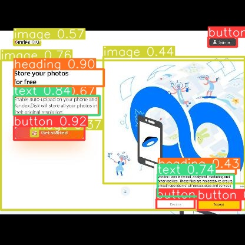

# ui_element_detection
Object Detection model to identify relevant elements of a webpage.

<h2>Sample Output: </h2>

  

Dataset : https://universe.roboflow.com/kbtu-yubl3/website-screens-ny1e6
Weights: train/weights

Results:
  Train: train
  
  Val: val
  
  Output: predict
  
  
